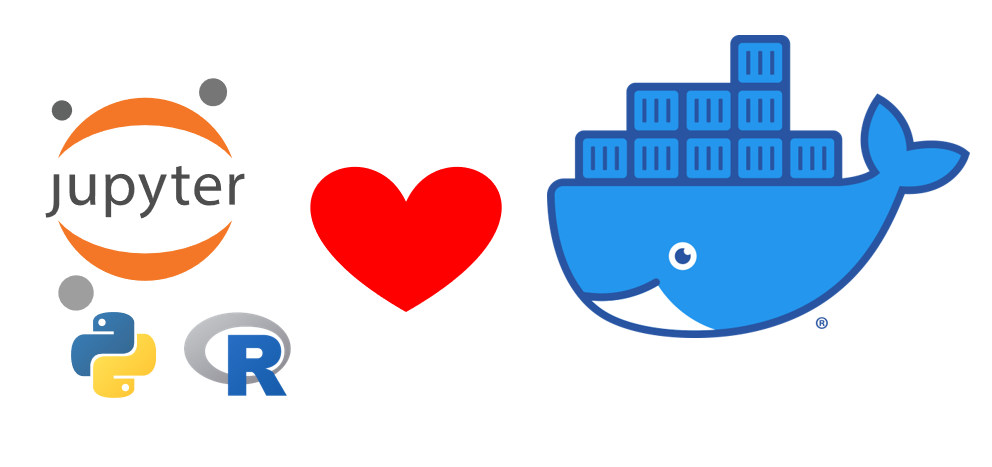

# Python developer Training

Este repositório tem por objetivo trazer uma visão geral sobre a <b>[Formação Python Developer](https://dio.me/curso-intensivo-python/AFMNN17O1R6T)</b> em um nível avançado, ofertado pela DIO.me.<br />

Esta formação possui 6 módulos conforme a estrutura definida a seguir:

- Módulo 1 - Fundamento de Python
    1. Conhecendo a Linguagem de Programação Python;
    2. Tipos de Operadores com Python;
    3. Estruturas Condicionais e de Repeticção com Python;
    4. Manipulando Strings com Python;
    5. Desafio 1[^1].
- Módulo 2 - Aprendendo Estruturas de Dados com Python
    1. Trabalhando com listas com Python;
    2. Conhecendo tuplas com Python;
    3. Explorando conjutos com Python;
    4. Aprendendo utilizar dicionários com Python;
    5. Dominando Funções com Python;
    6. Desafio 2[^].
- MÓDULO 3. Programação Orientada a Objetos com Python
    1. Introdução à P.O.O com Python;
    2. Aprendendo o conceito de herança com Python;
    3. Aplicando encapsulamento com Python;
    4. Conhecendo polimorfismo com Python;
    5. Ampliando o conhecimento em P.O.O com Python;
    6. Desafio 3[^1].
- MÓDULO 4. Integração com Python e Frameworks
    1. Integrando Python com banco de dados Relacionais utilizando o SQLAlchemy;
    2. Integrando Python com MongoDB utilizando Pymongo;
    3. Primeiros passos com o Framework Django;
    4. Primeiros passos com o Framework Flash;
    5. Boas práticas com Python;
    6. Integrando Python com SQLite e MongoDB;
    7. Desafio 4[^1].
- MÓDULO 5. Tratamento de Dados com Python
    1. Fundamentos de ETL (Extract, Transform, Load) com Python;
    2. Segurança da Informação com Python;
    3. Desafio 5[^1].
  MÓDULO 6. Praticando Desenvolvimento Web com Python
    1. Desenolvendo Rest APIs com Python e Flash;
    2. Desenvolvendo Web com Python e Django;
    3. Desafio 6[^1].

[^1]: Desafio do módulo pré-requisito para conclusão do curso e emissão de certificado.

A criação deste repositório, considerei trazer uma solução para pessoas que tenham dificultado com instalação de programas, e ou, não possuam um computador com capacidade para executar vários programas ao mesmo tempo. Pensando neste cenário, dentro da estrutura do repositório criei um arquivo chamado ==docker-compose.yaml==.

### Introdução para executar o arquivo yaml
- ❌ Não faça o download do projeto    ✅ Faça o fork utilizando a forma https ou ssh.
- Customize o tempo e desenvolvimento usando WSL2 com Docker Engine - [Tutorial](https://github.com/vitorkol/wsl2-without-docker-desktop).
- Instale o programa docker - *[docker](https://www.docker.com)*.
- Use o editor de texto de sua preferência Gitbash or VScode para clonar o repositório via fork.
- Navegue até a pasta raiz do projeto.
- Execute o compando ```docker compose up -d```.
- Executado o arquivo e criado o container no docker em seu naegador da web digite: <localhost:8080>.
- Pronto, agora você tem o python rodando com Conda, Julia e Jupyter Notebook rodando em sua máquina pelo browser.

